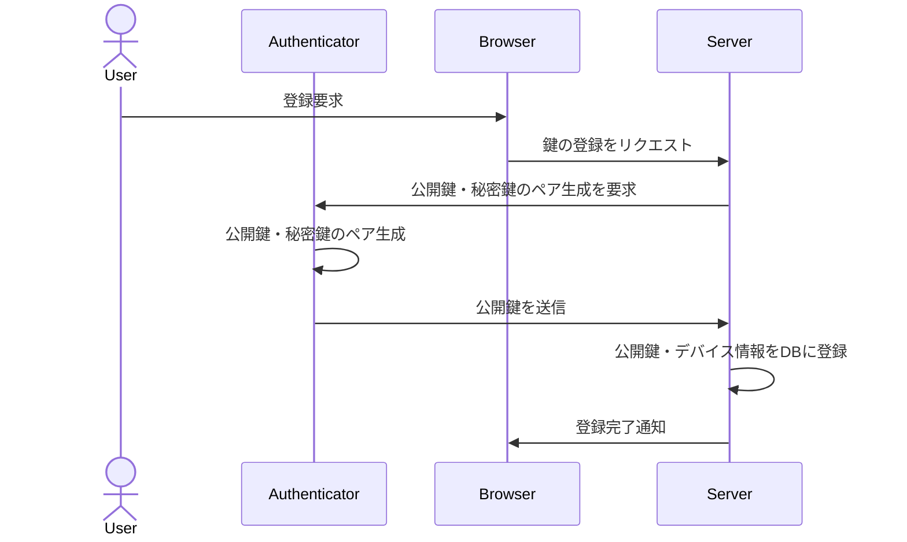
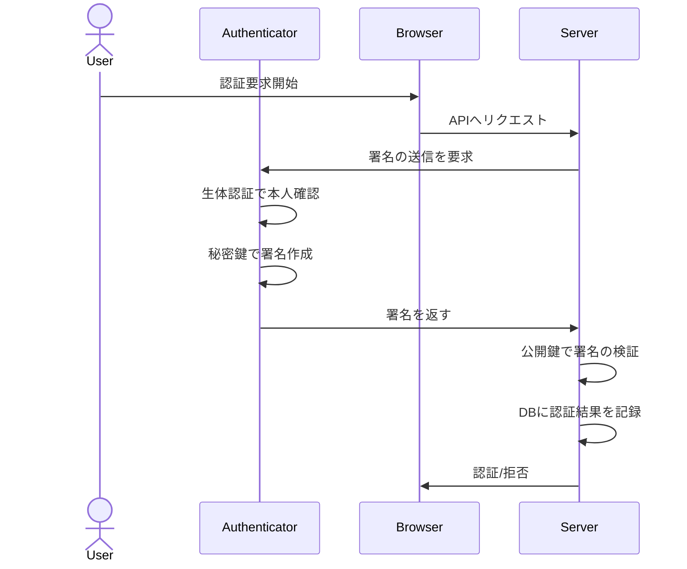

# FIDO2/WebAuthnとは
- FIDO2
- WebAuthn

# シーケンス
### WebAuthn認証における公開鍵登録フロー

### WebAuthn認証におけるパスワードレス認証フロー

AWSリソースベースのシーケンス図を書く

# Lambda関数
- CustomS3AutoDeleteObjectsCust-eDXjTHkR4qXi
  - 
- CreateAuthChallen-UOW0y5WZYTzI
  - create auth challenge
  - 認証用のチャレンジを生成してフロントエンドに送信
- DefineAuthChallen-NVy4AAATnbAY
  - define auth challenge
- Fido2ChallengePas-1lVImiEPV2Jh
  - fido2 challenge password
- Fido2Notification-Pz0QEg351k1j
- Fido2Passwordless-enYKOaJO0oKT
- PreSignupPassword-ffUGMKWeLEw3
- PreTokenPasswordl-abwsbOK5A7Pp
- VerifyAuthChallen-441RLPPoQkXS
  - verify auth challenge
  - フロントから送信された署名を検証する
  - ここの検証がOKならサインインに成功する