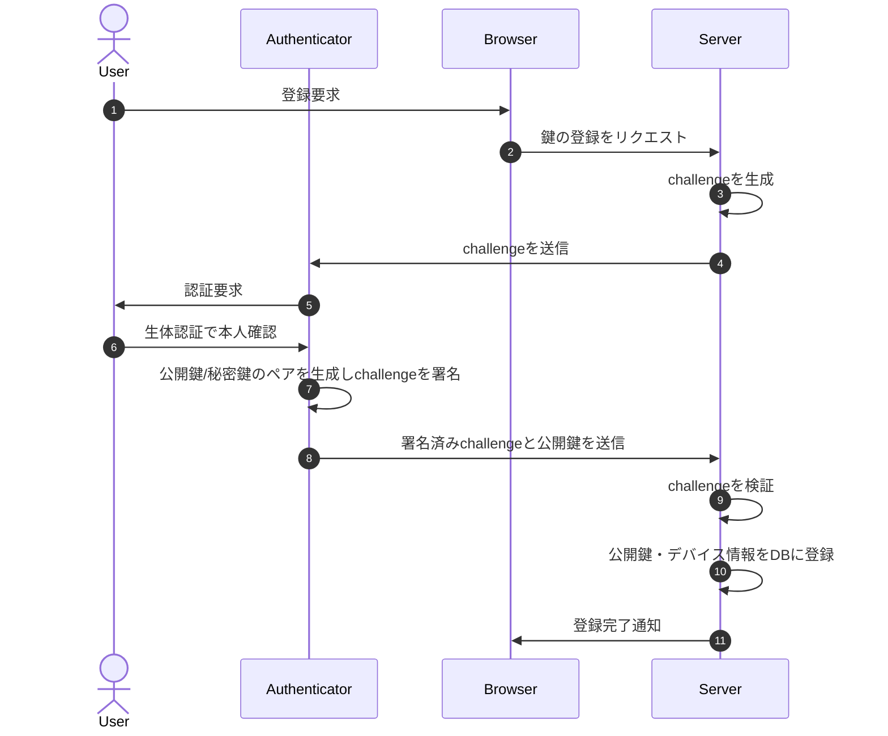
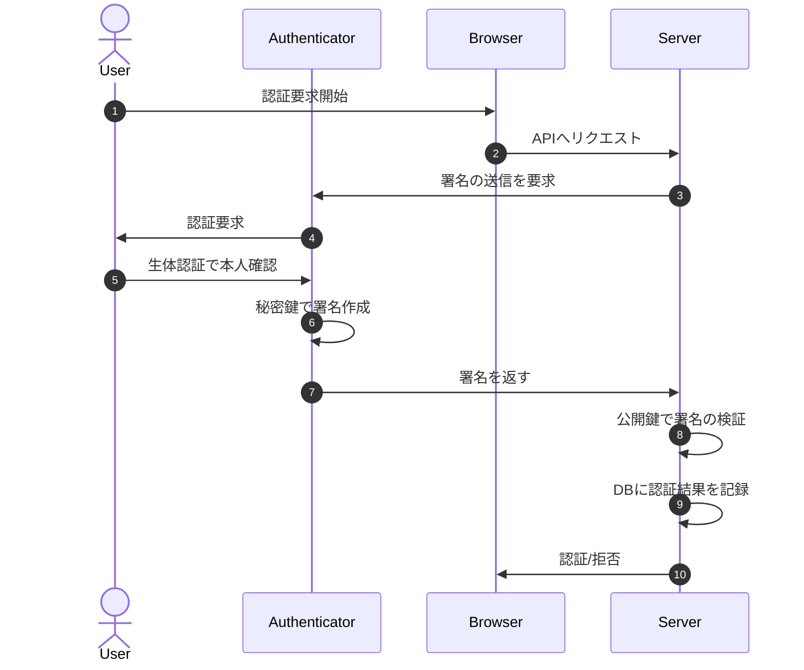

# WebAuthn
### 公開鍵登録フロー

7で生成された秘密鍵は端末に保存される。  
  
参考：https://developer.mozilla.org/ja/docs/Web/API/Web_Authentication_API#%E3%82%A6%E3%82%A7%E3%83%96%E8%AA%8D%E8%A8%BC%E3%81%AE%E6%A6%82%E5%BF%B5%E3%81%A8%E4%BD%BF%E3%81%84%E6%96%B9

### パスワードレス認証フロー

# AWSリソースを用いたWebAuthnの実装
### 公開鍵登録フロー
- fido2CreateCredential
  - fido2StartCreateCredential  
    - `register-authenticator/start`(cdk/custom-auth/fido2-credentials-api.ts)
      - DynamoDBに以下を登録
        - pk: `USER#${options.user.id}`,
        - sk: `CHALLENGE#${options.challenge}`,
        - options: options,
        - exp: `Math.floor((Date.now() + options.timeout) / 1000),`
  - `navigator.credentials.create`でキー生成
  - `register-authenticator/complete`
    - クレデンシャル作成完了通知（メール通知）

### パスワードレス認証フロー

> 引用：https://docs.aws.amazon.com/cognito/latest/developerguide/user-pool-lambda-challenge.html

- authenticateWithFido2
  - `navigator.credentials.get()`
    - userHandle(Base64)を取得し、そこからusernameを取得
  - initiateAuthにusernameを引数に渡してコールする(to Cognito)
- Cognitoカスタム認証フローの開始
  - [DefineAuth](https://docs.aws.amazon.com/cognito/latest/developerguide/user-pool-lambda-define-auth-challenge.html)
    - リクエストを元に認証方式を定義する
    - 新しいchallengeの発行や認証完了を通知する
  - [CreateAuthChallenge](https://docs.aws.amazon.com/cognito/latest/developerguide/user-pool-lambda-create-auth-challenge.html)
    - challengeを生成してクライアントに送信する
  - [VerifyAuthChallengeResponse](https://docs.aws.amazon.com/cognito/latest/developerguide/user-pool-lambda-verify-auth-challenge-response.html)
    - クライアントから送信されたchallengeを検証する

参考
- https://docs.aws.amazon.com/cognito/latest/developerguide/user-pool-lambda-define-auth-challenge.html
- https://github.com/aws-samples/amazon-cognito-passwordless-auth/blob/main/FIDO2.md

# backend.tsについて
[Passwordlessクラス](https://github.com/aws-samples/amazon-cognito-passwordless-auth/blob/main/cdk/lib/cognito-passwordless.ts)のコンストラクターがCDKを用いてAWSリソースを定義しているから。